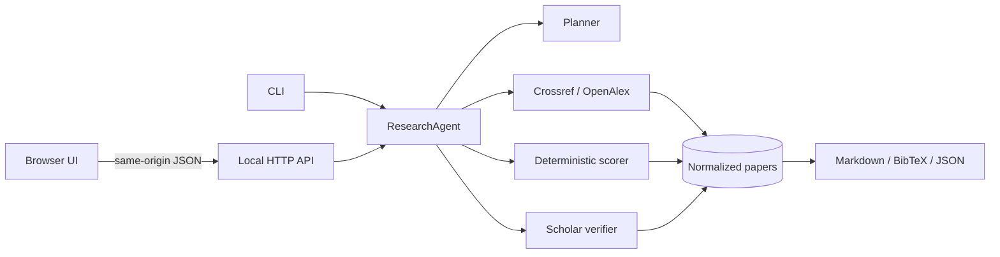

# Architecture

`ResearchAgent` is the orchestration boundary. The planner emits a validated plan; providers return a common paper dictionary; scoring and verification are pure or dependency-injected functions. This keeps metadata acquisition separate from ranking policy and makes every external call replaceable in tests.

The search loop runs at most two rounds and four queries, with a bounded provider fan-out. It stops when enough candidates have relevance ≥40, otherwise returns the partial recall it has. Candidates are filtered by requested years and retraction flags, then deduplicated by DOI or cautious title/year/author fallback. The displayed list is capped by `max_results`, limiting Scholar requests and cost.

The local server is intentionally small: same-origin requests, a 128 KB JSON body cap, two concurrent jobs, no cookies, no database and no credentials in logs or responses. It is designed for running the literature research workflow locally. A hosted version needs authentication, durable job isolation, provider quotas, a secret manager and a retention policy.

The optional OpenAI planner uses the Responses API Structured Outputs schema. The model sees the user's topic as data and returns a plan, never paper records. The server validates the response again before retrieval. The transparent rules planner remains the reproducible baseline and works offline.

## Tradeoffs

* Standard library only keeps first-run and supply-chain surface small; a production service should add an application server, observability and persistent jobs.
* OpenAlex and Crossref are complementary metadata indexes; citation counts are kept with their source and date rather than merged into a single fabricated truth.
* SerpAPI avoids unsupported Scholar scraping and CAPTCHA handling; no key means an explicit manual link.
* JIF is user-supplied, exact-ISSN matched and year-labeled. Commercial metric licensing is outside this repository.
